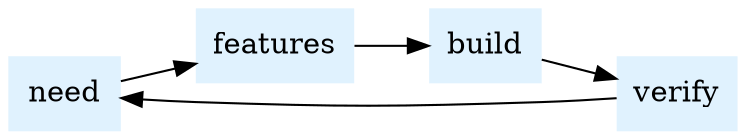
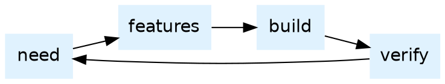
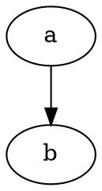
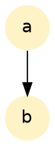

# 🧩 Diagram

Render a **live** Graphviz class diagram of the component model — built in the
browser from the wrapper classes themselves. There is no static image and no
build step: each class declares its knobs/behaviours via `@component(...)` and
dumps its own node through an inherited `to_dot()` (the single source of truth in
`steps_runtime.md`). The same code produces the committed [Component Model](model)
page at build time.

Attach `{: .diagram }` to a link. Add `scope="ClassName"` to focus on one class
plus its ancestors, association targets and subclasses. No scope → the whole
model.

It draws wherever the block appears — a static page, a runner render (the road
every course page takes to Canvas), the body of a folded accordion — and it
redraws once a `{: .model }` block lands the page's own classes in the runtime.
A model block stays hidden, so a lesson can declare eight classes out of sight
and show only their picture: `scope="OrderDetail,Order,Product"` names the
classes nothing points into, and the closure brings the rest.

## 🌍 Whole model

[Component model](#)
{: .diagram }

```gherkin
Feature: The component model renders as a live diagram
  As a curious lowcoder
  I want the class model drawn in the browser from its own source
  So that the diagram can never drift from the runtime

  Scenario: The block upgrades into a diagram
    Given the diagram above
    :::python
    self.dia: Object = Object._all(".lc-diagram")[0]
    :::
    When the page has upgraded it
    Then it is a visible diagram
    :::python
    assert self.dia.visible
    :::
```
{: .feature tags="lifecycle" status="passing" }

## 🔬 Scoped to one class

`scope="Chart"` shows `Chart` with everything it touches — its `Block`/`Object`
ancestry (merged UML inheritance) and its `Dataset` / `Bar` associations.

[Chart neighbourhood](#)
{: .diagram scope="Chart" }

## 🎛️ State machines

Components can declare a `states` list and mark methods with `@transition(pre, post)`.
The diagram then draws the state machine — initial state ➡️, transitions labelled
by the method, and `▹ guarded ▹` markers on the methods. `Recorder` goes
`idle → recording → stopped`:

[Recorder state machine](#)
{: .diagram scope="Recorder" }

## 📖 How to read it

- **◻️ / 🧩 icons** label each class; the panels list typed **knobs** (attributes)
  and **behaviours** (methods).
- **`➭ ◻️` / `➭ 🧩` markers** = inheritance from a root base (`Object` / `Block`),
  shown in the title instead of an edge to avoid a heavy fan of obvious lines.
- **Blue arrows** = associations, pointing up to the referenced class, labelled
  at the head (e.g. `bind`, `⦙ bars`).
- **Underscores read as spaces** (`has_class` → `has class`).
- Icons follow the same legend as
  `usecases/module_manager/backend/module_decorator.py` (shown in the diagram).

## 🔬 X-ray lens

Hold **⌥ Option / Alt** and sweep the round lens over **any rendered widget on
any page**: through the disc the widget is stripped to its **inner inspector** —
the component class with the **live value** of every attribute (inherited ones
too, like `id`), the **current state** in bold, and — for components that carry
one — the **live source of an event handler** (e.g. a `Button`'s `on_click`
Python body) shown inline under the ⚡ row. Add **⇧ Shift** to also draw
connectors to the widget's associated objects — a real arrow to a visible target
(e.g. `Form → Datagrid`), or a ghost chip for a hidden one (e.g. a `Dataset`).
Release the key to dismiss.

## ✏️ Draw your own — the `dot` fence

`{: .diagram }` draws **our model**. To draw **anything else** — a lifecycle, a
data flow, a decision tree — write a fenced block tagged `dot` and the page
renders it as a live diagram. Same engine[^graphviz], no image file, no build
step, and the source stays readable in the markdown.

**This is not standard Markdown.** A `dot` fence is a lightcodepedia feature: on
GitHub or in any other renderer that same block just shows as code. Here it
becomes a picture.

````markdown

````

Renders to:



### 🔍 Sizing — `zoom`

A big graph would otherwise arrive wider than the page and make the reader
scroll sideways before they can read anything. So a `dot` fence **fits the page
width by default**; a graph smaller than the page is left at its natural size
(blowing it up only blurs the type). Override with an IAL on the fence:

| `zoom=` | What you get |
|---|---|
| *(omitted)* or `fit` | Shrink to the page width if it overflows — never enlarge |
| `1.4`, `0.8`, … | That multiple of the graph's natural size; may scroll |
| `none` | Exactly as graphviz drew it |

````markdown

{: zoom="1.6" }
````


{: zoom="1.6" }

> Graphviz picks the layout for you — `rankdir=LR` for a left-to-right flow,
> `layout=circo` for a ring, the default for a top-down tree. Colour with
> `fillcolor`, and keep `bgcolor=transparent` so the diagram sits on the page
> instead of on a white slab.
{: .speaker-note }

```gherkin
Feature: A dot fence is a live diagram, sized to the page
  As an author
  I want to draw a picture in markdown
  So that a concept map never drifts from the page that explains it

  Scenario: The fence became a drawing, not a wall of source
    Given the loop diagram above
    :::python
    self.svgs: list = Object._all(".lc-dot-diagram")
    :::
    When the page has upgraded it
    Then at least two diagrams are drawn
    :::python
    assert len(self.svgs) >= 2, len(self.svgs)
    :::
```
{: .feature tags="lifecycle" status="passing" }

## 🔧 Knobs

| Attribute | Default | What it does |
|---|---|---|
| `scope="…"` | (whole model) | A **class** name (class + neighbours), a **package** (`ui` / `kore`), or `*` for the whole model |
| `states="…"` | `true` | Set `false`/`off` to hide the state-machine clusters |

## 🧠 Quick check

**Q:** This class diagram is drawn in the browser from the component classes themselves. Why bother, instead of a nice static PNG?

- [x] A PNG goes stale the second the code changes; this one literally cannot lie.
- [ ] PNGs are too mainstream.
- [ ] The author lost the PNG and panicked.
- [ ] Graphviz threatened legal action.
{: .quiz }

[^graphviz]: **Graphviz** — a long-standing open-source graph-drawing engine.
    You describe *what connects to what* in the DOT language; it decides where
    every box and line goes. Here it runs entirely in your browser (WebAssembly),
    so no server ever sees your diagram.
